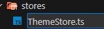

# Quy tắc tạo store

## Ví dụ: Hướng dẫn tạo Theme Store với Zustand

### Mục tiêu

Tạo một ThemeStore sử dụng Zustand để quản lý trạng thái isDark, biểu thị chế độ giao diện tối (Dark Mode) hoặc sáng (Light Mode) của ứng dụng. Store này sẽ bao gồm khả năng chuyển đổi giữa các chế độ và lưu trữ trạng thái trên local storage để không mất trạng thái khi tải lại trang.

#### **Bước 1: Tạo file store**

Tạo một file mới trong thư mục stores, đặt tên theo quy ước TênStore.ts. Ví dụ, chúng ta sẽ tạo file ThemeStore.ts.
Thư mục stores giúp tổ chức các state trong dự án, thuận tiện cho việc bảo trì và mở rộng khi có nhiều store

```bash
src/
└── stores/
    └── ThemeStore.ts
```



#### **Bước 2: Định nghĩa interface cho store**

Trong file ThemeStore.ts, bắt đầu bằng việc định nghĩa interface cho store. Interface này sẽ giúp định nghĩa các thuộc tính và phương thức cần có của store, giúp code rõ ràng và dễ bảo trì.

```ts
interface IThemeStore {
  toggle: () => void; // Hàm để chuyển đổi chế độ giữa Light và Dark Mode
  isDark: boolean; // Trạng thái hiện tại của giao diện (true là Dark Mode, false là Light Mode)
}
```

#### **Bước 3: Tạo store với Zustand và persist middleware**

- Import create từ zustand và persist từ zustand/middleware.
- Tạo store useThemeStore bằng cách sử dụng create và persist để lưu trữ trạng thái của isDark.
- Định nghĩa hàm toggle để chuyển đổi giữa chế độ tối và sáng.

```ts
import { create } from "zustand";
import { persist } from "zustand/middleware";

interface IThemeStore {
  toggle: () => void;
  isDark: boolean;
}

export const useThemeStore = create<IThemeStore>()(
  persist(
    (set, get) => ({
      isDark: false, // Mặc định là Light Mode
      toggle: () => {
        set({ isDark: !get().isDark }); // Đảo ngược trạng thái isDark khi gọi hàm toggle
      },
    }),
    {
      name: "ThemeStore", // Đặt tên cho localStorage key
    }
  )
);
```
