# Cấu trúc folder

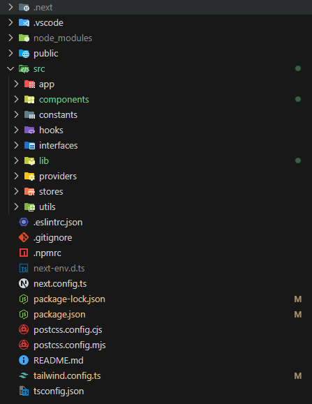

### Giải thích:

1. **.next** folder chạy web sau khi build.
1. **.vscode** chứa các setting như prettier khi sử dụng vscode
1. **node_modules** chứa các thư viện cài đặt sau khi chạy npm install
1. **public** chứa các media tĩnh (img,docx,videos)

   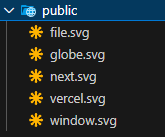

1. **app** chứa các page router của web
1. **components** chứa toàn bộ components tự setup để sử dụng làm giao diện

   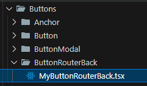
   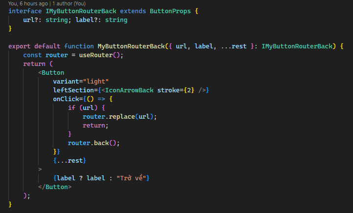

1. **constants** chứa các biến chung để sử dụng:

   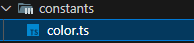
   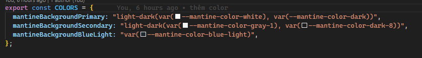

1. **hooks** chứa các hàm đặc biệt cho phép bạn sử dụng các tính năng của React như state và lifecycle

   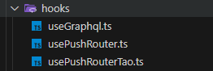
   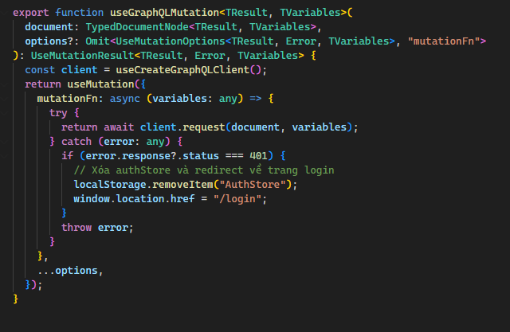

1. **interfaces** chứa các interface định nghĩa dùng chung

   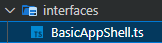
   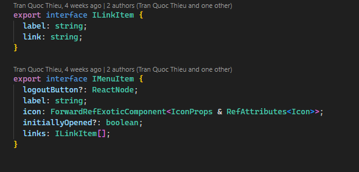

1. **lib** chứa hàm để sử dụng cho thư viện ui.aceternity - tailwind (không cần quan tâm)

1. **providers** config các provider của react query, mantine để áp dụng chung cho toàn bộ component mà không cần phải đi định nghĩa từng components

   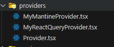
   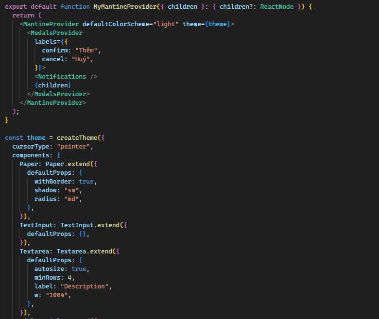
   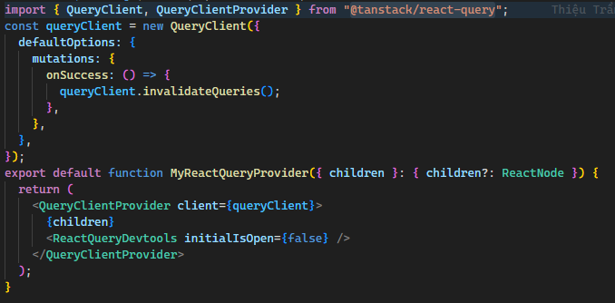

1. **stores** chứa các store (global state management - zustand) chung để sử dụng cho các việc authenticate các setting sidebar (lưu giá trị bật tắt, hành động), theme

   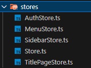
   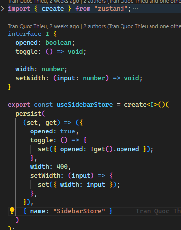

1. **utils** chứa các hàm tiện dụng dùng chung nhóm tự tạo

   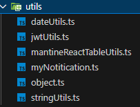
   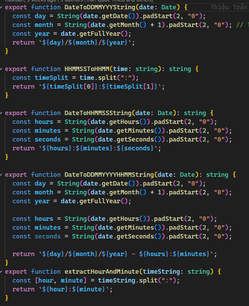
