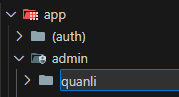

# Quy tắc tạo 1 trang nội dung

1. Tạo 1 folder với name sẽ được framework chuyển thành url:

   

1. Tạo 1 file đặt là page.tsx (Bắt )
1. MyPageContent

```tsx
export default function Page() {
  return (
    <MyPageContent rightTopBar={<FeatTaoVanBanQuyDinhToChucHoatDong />}>
      <FeatXemVanBanQuyDinhToChucHoatDong />
    </MyPageContent>
  );
}
```
