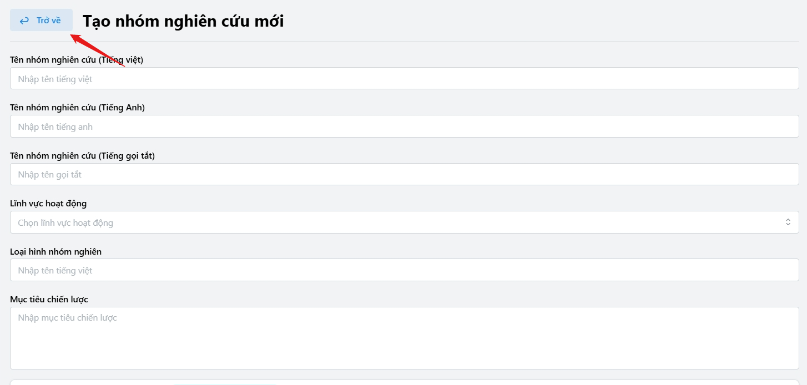

# Quy tắc tạo trang nội dung

1. Tạo 1 folder với name sẽ được framework chuyển thành url:

   

1. Tạo 1 file đặt là page.tsx (Bắt buộc)
1. Luôn bao với MyPageContent

```tsx
export default function Page() {
  return (
    <MyPageContent canBack rightTopBar={<FeatTaoVanBanQuyDinhToChucHoatDong />}>
      <FeatXemVanBanQuyDinhToChucHoatDong />
    </MyPageContent>
  );
}
```

:::warning[Lưu ý]

1. 1 trang luôn được export bằng Page in hoa
1. Không được xử lí logic tại trang này (Tất cả feature như update, delete, update, view được import và xử lí từ chỗ khác => nơi này chỉ xử lí router, layout và cách bố trí các feature)
1. Trong toàn bộ dự án không được xử dụng các component gốc của html ngoại trừ component `<form></form>`
   :::

:::tip[Mẹo]

1. Bạn có thể sử dụng một số properties trên MyPageContent như canback để dễ dàng thêm nút trở về:

```tsx
<MyPageContent canBack rightTopBar={<FeatTaoVanBanQuyDinhToChucHoatDong />}>
  <FeatXemVanBanQuyDinhToChucHoatDong />
</MyPageContent>
```



:::
