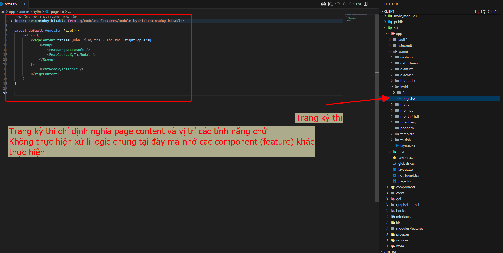
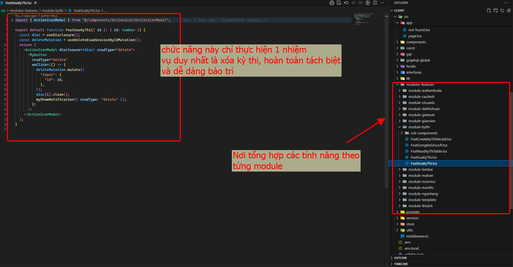

# SOLID

Trong đó:

- S: Single-responsibility Principle
- O: Open-closed Principle
- L: Liskov Substitution Principle
- I: Interface Segregation Principle
- D: Dependency Inversion Principle

### Single-responsibility Principle

Chia chức năng theo feature slide

Ví dụ:




### Open-closed Principle

Nguyên tắc Open-closed (Open-closed Principle - OCP) trong lập trình hướng đối tượng khuyến khích rằng các module, lớp hoặc thành phần trong ứng dụng nên "mở cho việc mở rộng nhưng đóng cho việc sửa đổi". Điều này có nghĩa là khi muốn thay đổi hành vi của một phần của hệ thống, bạn nên mở rộng hoặc thêm mới thay vì sửa đổi trực tiếp mã hiện có.

Trong ứng dụng Next.js kết hợp với Mantine, bạn có thể áp dụng nguyên tắc này bằng cách tạo các thành phần (components) dễ mở rộng. Ví dụ, chúng ta sẽ xây dựng một component CustomButton, mà có thể dễ dàng mở rộng các chức năng mà không cần sửa mã gốc.

#### Bước 1: Tạo CustomButton component

Giả sử chúng ta muốn tạo một component CustomButton đơn giản sử dụng Mantine's Button, và có thể dễ dàng mở rộng bằng cách thêm các style hoặc logic mới.

```tsx
// components/CustomButton.tsx
import React from "react";
import { Button, ButtonProps } from "@mantine/core";

// Sử dụng OCP để tạo một Button cơ bản nhưng dễ mở rộng
interface CustomButtonProps extends ButtonProps {
  label: string;
}

export const CustomButton: React.FC<CustomButtonProps> = ({
  label,
  ...props
}) => {
  return <Button {...props}>{label}</Button>;
};
```

Ở đây, CustomButton đơn giản chỉ là một lớp Button của Mantine, nhưng chúng ta đã thêm một label để hiển thị văn bản. Giờ đây, CustomButton có thể sử dụng cho các trường hợp cơ bản và dễ mở rộng cho các nhu cầu khác

#### Bước 2: Mở rộng CustomButton mà không cần sửa đổi mã gốc

Tiếp theo, hãy tạo một phiên bản PrimaryButton từ CustomButton có một số thuộc tính mặc định để làm nổi bật nó (như màu nền đặc biệt hoặc icon), mà không sửa đổi CustomButton.

```tsx
// components/PrimaryButton.tsx
import React from "react";
import { CustomButton, CustomButtonProps } from "./CustomButton";

interface PrimaryButtonProps extends CustomButtonProps {
  icon?: React.ReactNode;
}

export const PrimaryButton: React.FC<PrimaryButtonProps> = ({
  icon,
  label,
  ...props
}) => {
  return (
    <CustomButton
      label={label}
      leftIcon={icon}
      color="blue"
      radius="md"
      {...props}
    />
  );
};
```

PrimaryButton này kế thừa từ CustomButton và thêm các thuộc tính mở rộng (như icon, color, radius). Nhờ đó, bạn có thể dễ dàng thêm kiểu mới cho nút mà không thay đổi CustomButton.

#### Sử dụng trong Next.js

Bạn có thể sử dụng PrimaryButton trong bất kỳ trang hoặc component nào trong ứng dụng Next.js mà không ảnh hưởng đến mã gốc của CustomButton.

```tsx
// pages/index.tsx
import React from "react";
import { PrimaryButton } from "../components/PrimaryButton";
import { IconCheck } from "@tabler/icons-react";

export default function HomePage() {
  return (
    <div>
      <PrimaryButton label="Submit" icon={<IconCheck />} />
    </div>
  );
}
```

Lợi ích

- Mở rộng mà không sửa đổi: Bạn có thể dễ dàng tạo nhiều biến thể của CustomButton mà không làm ảnh hưởng đến mã gốc của nó.
- Dễ dàng bảo trì: Nếu có thay đổi về cấu trúc hoặc giao diện của CustomButton, chỉ cần cập nhật ở component gốc, tất cả các component mở rộng khác sẽ tự động được cập nhật theo.
- Tái sử dụng: Với cấu trúc như vậy, các component có thể được tái sử dụng ở nhiều nơi với các kiểu và chức năng khác nhau.
  Việc áp dụng Open-closed Principle giúp code dễ mở rộng, dễ bảo trì và làm việc với các tính năng phức tạp trong ứng dụng Next.js và Mantine.

### Liskov Substitution Principle (LSP)

Nguyên tắc thứ ba trong SOLID, quy định rằng các lớp con phải có khả năng thay thế cho các lớp cha của chúng mà không làm thay đổi tính đúng đắn của chương trình. Điều này có nghĩa là khi bạn kế thừa một lớp, lớp con nên có thể sử dụng thay cho lớp cha mà không gây ra lỗi hoặc hành vi không mong muốn.

Dưới đây là một ví dụ về LSP trong ứng dụng Next.js, với giả định bạn có một component quản lý các loại thẻ (cards) khác nhau hiển thị trên trang. Các thẻ này đều có chung một số hành vi cơ bản, nhưng mỗi loại thẻ lại có một số đặc điểm riêng.

#### Bước 1: Tạo lớp cơ sở Card

Đầu tiên, chúng ta sẽ tạo một component cơ sở là Card, mà chỉ đơn giản là hiển thị nội dung.

```tsx
// components/Card.tsx
import React from "react";

interface CardProps {
  title: string;
  description: string;
}

export const Card: React.FC<CardProps> = ({ title, description }) => {
  return (
    <div
      style={{ border: "1px solid #ddd", padding: "16px", borderRadius: "8px" }}
    >
      <h2>{title}</h2>
      <p>{description}</p>
    </div>
  );
};
```

#### Bước 2: Tạo các lớp con ImageCard và LinkCard

Giờ đây, chúng ta sẽ tạo các lớp con từ Card. Mỗi lớp con sẽ mở rộng Card với những tính năng riêng, nhưng vẫn có thể được sử dụng thay thế cho Card cơ bản mà không gây ra lỗi.

Thẻ có ảnh (ImageCard)

```tsx
// components/ImageCard.tsx
import React from "react";
import { Card } from "./Card";

interface ImageCardProps {
  title: string;
  description: string;
  imageUrl: string;
}

export const ImageCard: React.FC<ImageCardProps> = ({
  title,
  description,
  imageUrl,
}) => {
  return (
    <div
      style={{ border: "1px solid #ddd", padding: "16px", borderRadius: "8px" }}
    >
      
      <h2>{title}</h2>
      <p>{description}</p>
    </div>
  );
};
```

Thẻ có liên kết (LinkCard)

```tsx
// components/LinkCard.tsx
import React from "react";
import { Card } from "./Card";

interface LinkCardProps {
  title: string;
  description: string;
  link: string;
}

export const LinkCard: React.FC<LinkCardProps> = ({
  title,
  description,
  link,
}) => {
  return (
    <div
      style={{ border: "1px solid #ddd", padding: "16px", borderRadius: "8px" }}
    >
      <h2>{title}</h2>
      <p>{description}</p>
      <a href={link} target="_blank" rel="noopener noreferrer">
        Learn more
      </a>
    </div>
  );
};
```

#### Bước 3: Sử dụng các lớp con trong trang Next.js

Bây giờ, bạn có thể sử dụng ImageCard và LinkCard thay cho Card mà không làm ảnh hưởng đến tính đúng đắn của hệ thống. Các lớp con này tuân thủ LSP vì chúng có thể được sử dụng thay thế cho Card mà không gây ra lỗi.

```tsx
// pages/index.tsx
import React from "react";
import { Card } from "../components/Card";
import { ImageCard } from "../components/ImageCard";
import { LinkCard } from "../components/LinkCard";

export default function HomePage() {
  return (
    <div>
      <Card title="Basic Card" description="This is a basic card." />
      <ImageCard
        title="Card with Image"
        description="This card includes an image."
        imageUrl="https://via.placeholder.com/300"
      />
      <LinkCard
        title="Card with Link"
        description="This card includes a link."
        link="https://example.com"
      />
    </div>
  );
}
```

Lợi ích khi áp dụng LSP

- Tính thay thế: Bạn có thể sử dụng ImageCard hoặc LinkCard thay cho Card mà không cần thay đổi mã nguồn.
- Tăng cường tái sử dụng: Các lớp con có thể thêm tính năng mới mà không ảnh hưởng đến cấu trúc của Card.
- Đảm bảo tính nhất quán: Nếu có thay đổi trong cách hiển thị thẻ, bạn chỉ cần sửa ở lớp cha Card, tất cả các lớp con sẽ được hưởng lợi từ sự thay đổi này.

Tuân thủ nguyên tắc Liskov Substitution Principle giúp bạn dễ dàng mở rộng và bảo trì mã, đảm bảo các lớp con có thể được thay thế an toàn cho lớp cha mà không làm ảnh hưởng đến logic của ứng dụng.

### Dependency Inversion Principle (DIP)

Dependency Inversion Principle (DIP) là một trong năm nguyên tắc SOLID trong lập trình hướng đối tượng. DIP đề xuất rằng các module cấp cao không nên phụ thuộc vào các module cấp thấp; thay vào đó, cả hai nên phụ thuộc vào các abstraction. Việc này giúp code dễ test và mở rộng hơn.

Ví dụ 1: DIP cho Testing API với JSON Data
Giả sử bạn đang muốn tạo một API giả để test việc xóa một sinh viên mà không cần kết nối với backend thực. Ta sẽ tạo một abstraction để xử lý API, và sử dụng một service cụ thể cho dữ liệu giả (JSON).

#### Bước 1: Tạo abstraction cho API sinh viên

Tạo một interface để định nghĩa các hành động có thể thực hiện với sinh viên, ví dụ trong `services/studentService.ts:`

```ts
// services/studentService.ts

export interface StudentService {
  deleteStudent(id: string): Promise<void>;
}
```

#### Bước 2: Tạo một service giả (Mock) để test

Tạo một service MockStudentService chỉ sử dụng JSON để quản lý sinh viên. Điều này giúp test logic mà không cần gọi API thật.

```ts
// services/mockStudentService.ts
import { StudentService } from "./studentService";

const mockStudents = [
  { id: "1", name: "Alice" },
  { id: "2", name: "Bob" },
];

export class MockStudentService implements StudentService {
  async deleteStudent(id: string): Promise<void> {
    const index = mockStudents.findIndex((student) => student.id === id);
    if (index !== -1) {
      mockStudents.splice(index, 1);
    }
    console.log("Mock delete student with ID:", id);
  }
}
```

#### Bước 3: Sử dụng mock service trong component

Trong component, inject service này để test:

```tsx
// components/StudentList.tsx
import { MockStudentService } from "../services/mockStudentService";

const studentService = new MockStudentService();

export default function StudentList() {
  const handleDelete = async (id: string) => {
    await studentService.deleteStudent(id);
    console.log("Student deleted for testing:", id);
  };

  return <button onClick={() => handleDelete("1")}>Delete Student</button>;
}
```

**### Ví dụ 2: DIP với API Thực tế và React Hook để Xóa Sinh Viên**

Với API thực, ta sẽ tạo một RealStudentService để thực hiện yêu cầu HTTP và sử dụng nó trong một custom React hook.

#### Bước 1: Tạo service thực tế

Trong services/realStudentService.ts, tạo class RealStudentService để gọi API xóa sinh viên thực sự.

```ts
// services/realStudentService.ts
import { StudentService } from "./studentService";

export class RealStudentService implements StudentService {
  async deleteStudent(id: string): Promise<void> {
    const response = await fetch(`/api/students/${id}`, {
      method: "DELETE",
    });
    if (!response.ok) {
      throw new Error("Failed to delete student");
    }
  }
}
```

### Bước 2: Tạo custom hook để gọi deleteStudent

Trong hooks/useDeleteStudent.ts, sử dụng RealStudentService để xóa sinh viên với React hook:

```ts
// hooks/useDeleteStudent.ts
import { useState } from "react";
import { RealStudentService } from "../services/realStudentService";

const studentService = new RealStudentService();

export function useDeleteStudent() {
  const [isLoading, setLoading] = useState(false);
  const [error, setError] = useState<string | null>(null);

  const deleteStudent = async (id: string) => {
    setLoading(true);
    setError(null);
    try {
      await studentService.deleteStudent(id);
    } catch (err) {
      setError("Failed to delete student");
    } finally {
      setLoading(false);
    }
  };

  return { deleteStudent, isLoading, error };
}
```

#### Bước 3: Sử dụng custom hook trong component

Cuối cùng, sử dụng hook useDeleteStudent trong một component.

```tsx
// components/StudentList.tsx
import { useDeleteStudent } from "../hooks/useDeleteStudent";

export default function StudentList() {
  const { deleteStudent, isLoading, error } = useDeleteStudent();

  const handleDelete = (id: string) => {
    deleteStudent(id);
  };

  return (
    <div>
      <button onClick={() => handleDelete("1")} disabled={isLoading}>
        {isLoading ? "Deleting..." : "Delete Student"}
      </button>
      {error && <p>{error}</p>}
    </div>
  );
}
```

Tóm tắt

- Mock Service: Sử dụng MockStudentService để test mà không cần API thật.
- Real Service: Sử dụng RealStudentService với fetch để xóa sinh viên từ API.
- Custom Hook: Đóng gói logic xóa sinh viên trong useDeleteStudent hook để tái sử dụng.
